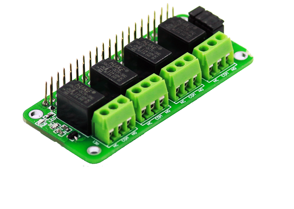

# Relay-4-Zero
 
 

## Specifications:
  * 4 - High quality 3V Relay and loads up to 2A/24V DC or 2A/120VAC
  * LEDs for indicating status of each relay
  * Standardized shield shape and design
  * Raspberry Pi 4, 3, 2, and ZERO compatible 40-Pin Stacking Header
  
## Installing Relay 4 Zero library:

  * Open Terminal and download the code by writing:
  
    > git clone https://<i></i>github.com/sbcshop/Relay-4-Zero.git
  
  * Your code will be downloaded to '/home/pi' directory.

  * 'test1.py' is example code for Zero Relay. Run test file and controll your devices with ZeroRelay
  
 ## Pin Description: 
 Relays are connected to the pins of the Rasberry Pi. Description of the pins connection is shown below.
   
| Relay   | Board Pin  |
| ------  | ---------  |
| Relay1  | Pin 31  |
| Relay2  | Pin 33  |
| Relay3  | Pin 35  |
| Relay4  | Pin 37  |
   